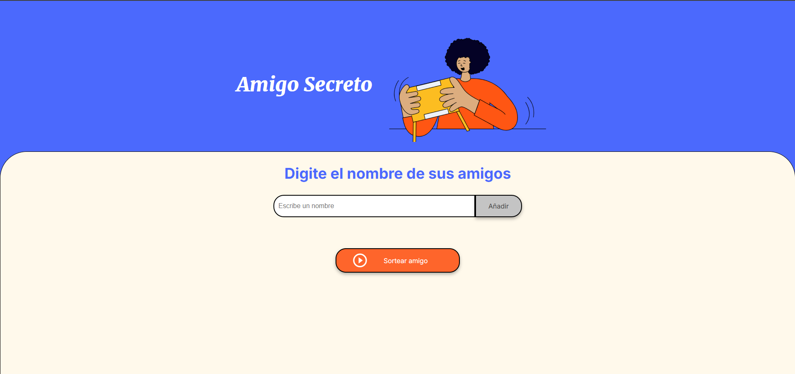

# 🎁 Amigo Secreto

¡Hola este es el juego de **Amigo Secreto**! 🎉 
Esta aplicación web te permite agregar una lista de amigos y sortear un nombre de manera aleatoria, asegurando que **no se repita** hasta que todos hayan sido seleccionados. Ideal para juegos, intercambios de regalos o simplemente para divertirse con amigos.  

## 🚀 **Características**
✔️ Agrega nombres de amigos a una lista.  
✔️ Sortea un nombre aleatorio sin repeticiones hasta que todos hayan salido.  
✔️ Restablece el sorteo automáticamente cuando todos han sido elegidos.  
✔️ Validación para evitar nombres duplicados en la lista.  
✔️ Interfaz intuitiva y fácil de usar.  

---

## 📸 **Vista previa**   

  

---

## 🔧 **Tecnologías utilizadas**
- HTML5  
- CSS3  
- JavaScript
